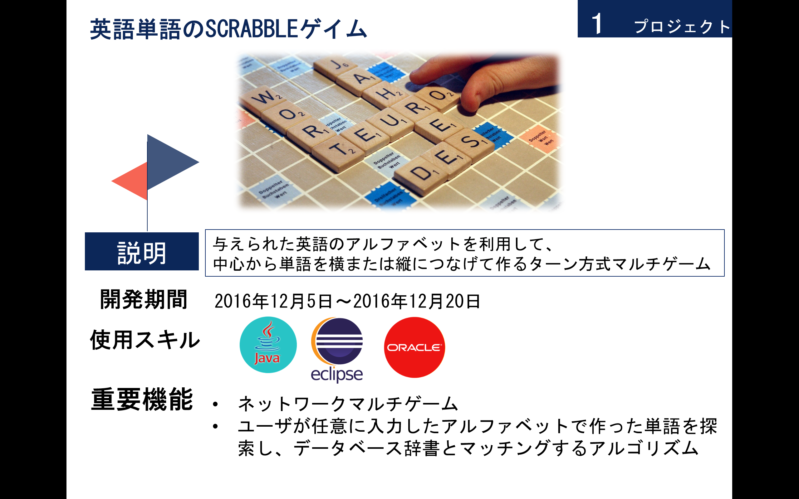
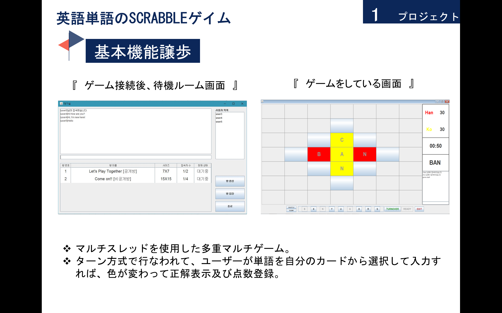
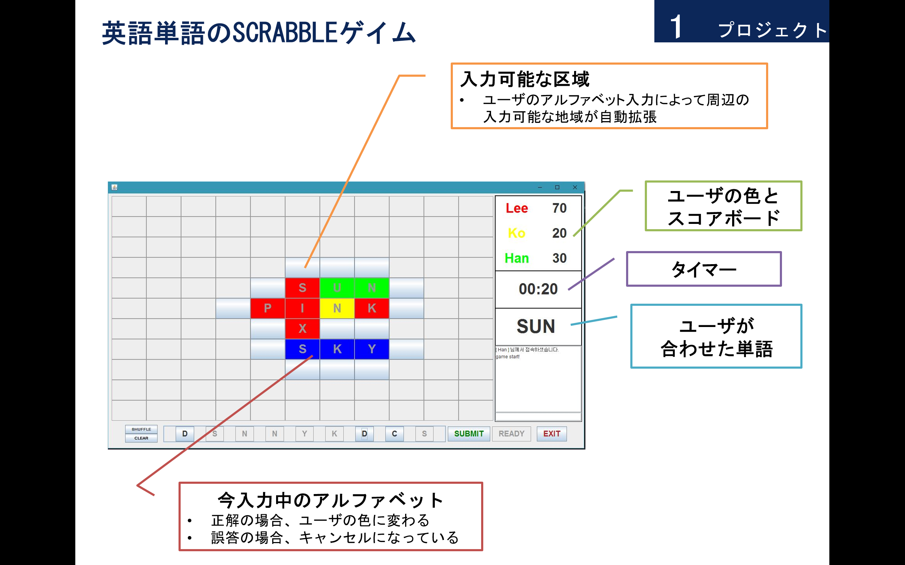
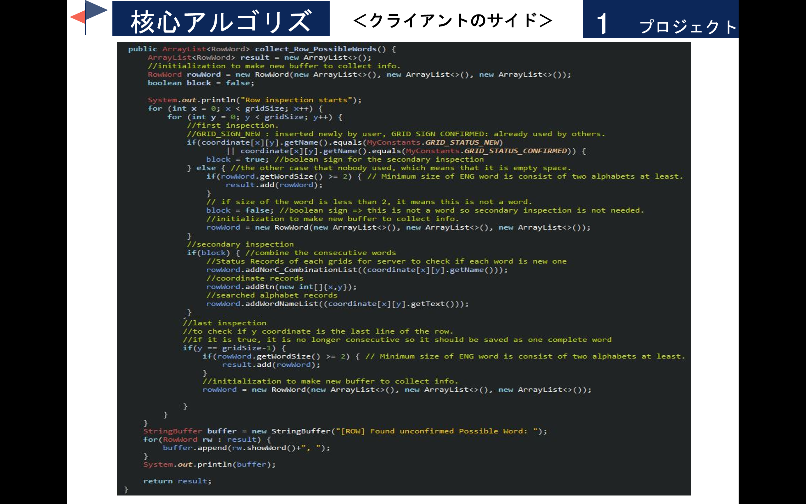
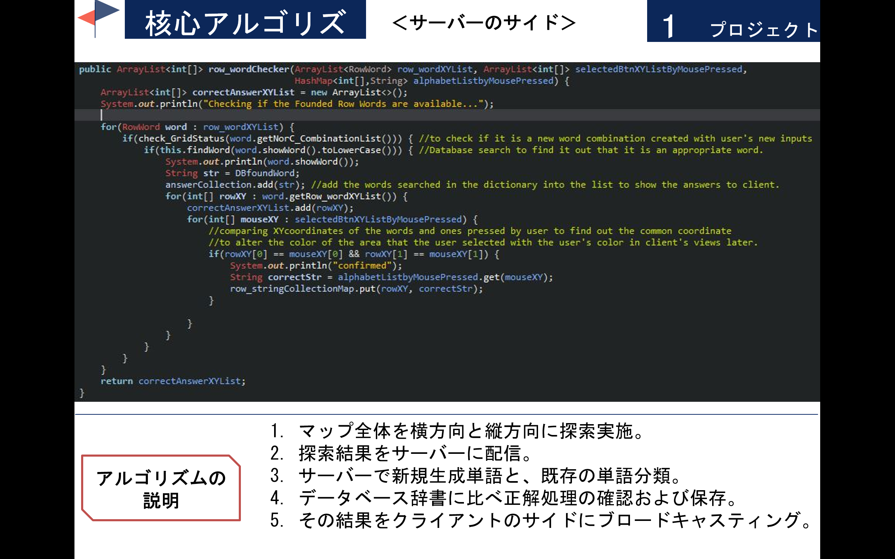
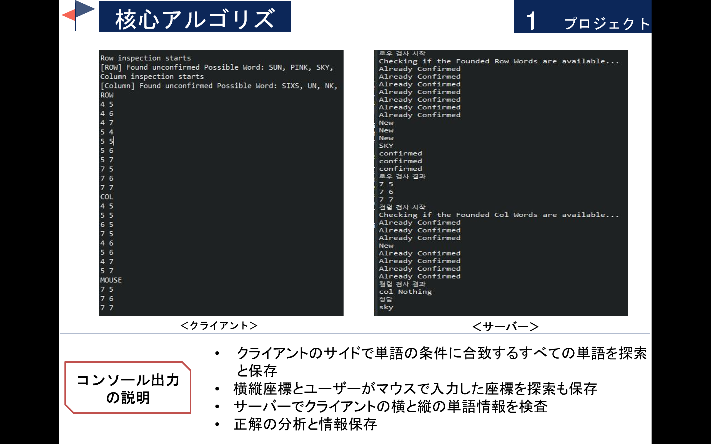

Project name: Scrabble (Under Construction)
===

### Background
This is java standalone application game that I made when I had started learning Java(JavaSE 1.7) as my first programming language long time ago(Probably, around end of 2016).  
Very raw-ish and out-of-mind code. When I was creating this project, I had no idea at all about data structure, what clean code is, coding convention, dev tools and process and so on.
All I knew is small knowledge of java and basic coding skill.  

### Purpose
Now, I'm thinking of refactoring and renewing this project to make better with my accumulated experiences.  
Creating a new side proejct is good learning but I thought that refactoring old ones would be gonna be good experience too.
Because, at work, I have been experiencing that it is likely to encounter maintaining or fixing bugs reportred, more than creating new services.
Plus, I felt that it was definitely required to make cleaner code that the others can easily understand what I intended in the code for the `TEAM WORK`. 
Besides, I guess this Scrabble project would be good practice in terms of data structures that have complicated grid and word combination info.
Let's see how it's gonna be newly refactored!

### Initial Features
This project consists of two parts, client and server, implementing broadcasting and Java Swing UI.  
Details of this project is following in the end of this README.

### Initial Spec <------------------------------- Current 
* DEV OS: Windows7  
* Language: JavaSE 1.7  
* DB: Oracle Express Edition 11g  
* IDE: Eclipse  

#### Phase1) Refactoring 
* JavaSE1.7 -> OpenJDK11(Amazon Correctto)  
* Refactors using Java Stream  
* Oracle 11g -> Redis
* IDE -> vscode  
* DEV OS: Windows10 with WSL

#### Phase2) Changing platform
* Java Standalone Application -> Web Application  
* Frontend: Java Swing -> React(Typescript)  
* Runs in Docker
* IDE -> vscode  

### Newly Additional Features
...

### <Final Spec>  
* OS: Docker Linux Contianer   
* IDE: VS Code  
* Language: OpenJDK11(Amazon Correctto), React(Typescript)  
* DB: Redis  

### FYI, this is an introduction of the project that I initially created a long time ago when I just had began learning programming.

